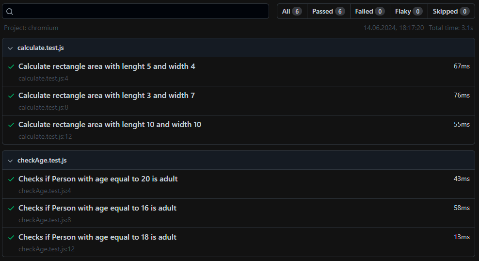

# Testing functions using `Playwright`

## Function `calculateRectangleArea`

### Desctiption

- Function is located in: [calculate.js](./calculate.js)
- Function should calculate rectangle area, from passed as arguments values: lenght and width

### Testing

- Function was tested using `Playwright` framework
- Function passes all (3) Test Cases:

  ```
  test('Calculate rectangle area with lenght 5 and width 4', () => {
  expect(calculateRectangleArea(5, 4)).toBe(20);
  });

  test('Calculate rectangle area with lenght 3 and width 7', () => {
  expect(calculateRectangleArea(3, 7)).toBe(21);
  });

  test('Calculate rectangle area with lenght 10 and width 10', () => {
  expect(calculateRectangleArea(10, 10)).toBe(100);
  });
  ```

- Tests are located in [calculate.test.js](./tests/calculate.test.js)

## Function `isAdult`

### Description

- Function is located in: [checkAge.js](./checkAge.js)
- Function should return boolean type value (true or false) depending on that a person's age fullfill the condition to be over (or equal) 18 years old

### Testing

- Function was tested using `Playwright` framework
- Function passes all (3) Test Cases:

  ```
  test('Checks if Person with age equal to 20 is adult', () => {
  expect(isAdult(20)).toBe(true);
  });

  test('Checks if Person with age equal to 16 is adult', () => {
  expect(isAdult(16)).toBe(false);
  });

  test('Checks if Person with age equal to 18 is adult', () => {
  expect(isAdult(18)).toBe(true);
  });
  ```

- Tests are located in [checkAge.test.js](./tests/checkAge.test.js)

## Playwright tests raport



#### The same Tasks were tested using `Jasmine` framework in [goit-qaa-ad-hw-02](https://github.com/MioLuczak/goit-qaa-ad-hw-02) GitHub repository
